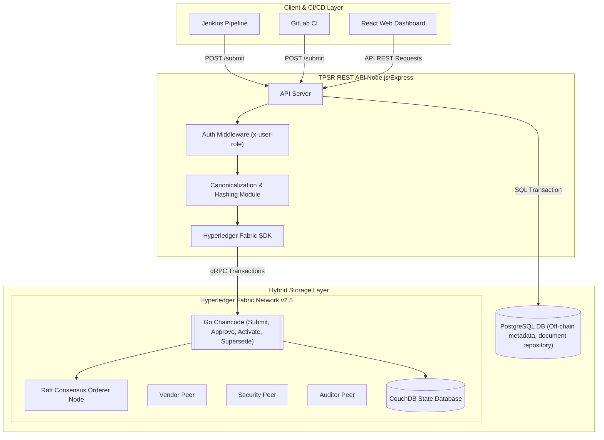
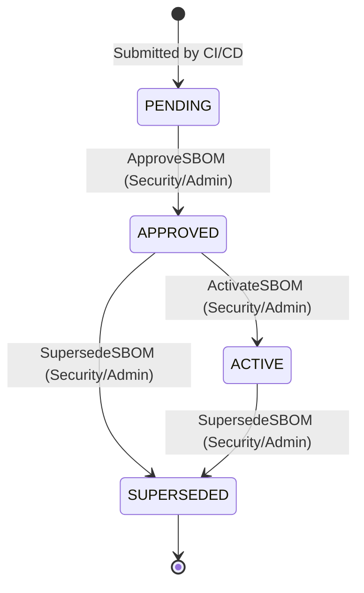

# Tamper-Proof SBOM Registry (TPSR) — Project Overview

A state-of-the-art, secure, and resilient system for anchoring, verifying, and managing the lifecycle of **Software Bill of Materials (SBOMs)** using a hybrid architecture of **Hyperledger Fabric Blockchain** and **PostgreSQL Database**.

---

## 1. Problem Statement

In modern software engineering, the software supply chain faces severe security threats. Organizations must guarantee the authenticity, integrity, and provenance of third-party dependencies and internal software builds. 

**Software Bill of Materials (SBOMs)** are critical documents containing comprehensive lists of components, libraries, and licenses in a software release. However, traditional centralized storage systems (like relational databases or raw file servers) present a single point of failure:
* **Tampering & Collusion:** Malicious actors or compromised insiders can modify historical SBOMs to hide vulnerable libraries or backdoor additions.
* **Deletion Vulnerabilities:** Unauthorized deletion of audit trails leaves security teams blind during retrospective threat assessments (e.g., Log4j-style audits).
* **Missing Lifecycle Trace:** Centralized systems lack trusted, un-alterable records of state transitions (e.g., when an SBOM was approved, active, or superseded).

---

## 2. Project Objective

The objective of **TPSR** is to provide an immutable, auditable, and high-performance registry for SBOMs that:
1. **Ensures Data Integrity:** Employs blockchain-anchored SHA-256 hashes of canonicalized SBOMs (supporting both SPDX and CycloneDX formats).
2. **Maintains High Performance & Queryability:** Utilizes a hybrid storage model where rich, queryable metadata is stored in an off-chain PostgreSQL database, while tamper-proof hashes and transaction records are anchored on Hyperledger Fabric.
3. **Supports Secure Lifecycle Workflows:** Restricts critical lifecycle actions (Approve, Activate, Supersede) using role-based access control (RBAC).
4. **Integrates with DevSecOps:** Seamlessly plugs into automated CI/CD pipelines (Jenkins, GitLab CI) to register SBOMs immediately at build-time.
5. **Provides a Rich Audit Trail:** Offers security officers and auditors a complete history trace of all transactions, transitions, and compliance statuses.

---

## 3. System Architecture

TPSR operates on a premium **Hybrid Architecture** combining permissioned blockchain capabilities with relationally mapped transactional storage.



### Architectural Pillars

#### 1. Immutability Layer (Hyperledger Fabric v2.5)
* **Consensus:** Crash Fault Tolerant (CFT) Raft consensus.
* **Nodes:** Multi-organization network involving **Vendor**, **Security**, and **Auditor** entities.
* **State Database:** CouchDB for JSON-based rich queries on the ledger.
* **Chaincode:** Written in **Go**, managing the core transaction engine, state machines, and history tracking.

#### 2. Query & Document Storage Layer (PostgreSQL)
* Houses the raw, full-size JSON/XML SBOM files (to avoid overwhelming the blockchain's state storage).
* Stores audit-trail metadata, verification logs, and compliance records.
* Optimized for high-throughput, sub-millisecond listings, and full text search queries.

#### 3. Transition Control (Two-Phase Submit Protocol)
To ensure database consistency with the blockchain:
1. When an SBOM is submitted, the API starts a PostgreSQL transaction and stores the raw document.
2. The hash, metadata, and status are submitted as a transaction to the Hyperledger Fabric chaincode.
3. Upon a successful consensus response, the API commits the PostgreSQL transaction, updating the off-chain record with the Fabric Transaction ID and Submitter ID.
4. If the blockchain write fails, the PostgreSQL transaction is rolled back, preventing orphaned records.

---

## 4. Key Features

### 🔐 1. Immutable Integrity Hashing & Canonicalization
* Automatic parsing of JSON and XML formats.
* Deterministic canonicalization module that normalizes property ordering, spacing, and casing to generate reproducible SHA-256 hashes.
* Tamper detection: compares a re-hashed local file against the immutable blockchain anchor to verify authenticity.

### 🔄 2. Extended SBOM Lifecycle State Machine
Ensures every software artifact transitions through a strict, auditable path:
* **PENDING:** Registered at build time but not yet evaluated.
* **APPROVED:** Evaluated and approved by Authorized Security personnel.
* **ACTIVE:** Currently accepted for production use.
* **SUPERSEDED:** Retained for historic audit but flagged as out-of-date or replaced.



### 👥 3. Role-Based Access Control (RBAC) & Prototype Selector
* Middleware-enforced route permissions.
* Roles simulated: `developer`, `security`, `auditor`, `admin`.
* Dashboard Identity Selector: enables easy on-the-fly simulation of various roles to demonstrate RBAC validation.
* UI-level button gating: actions like "Approve", "Activate", and "Supersede" dynamically display/hide based on the active role and status of the record.

### 📊 4. Interactive Audits & Compliance Reporting
* **Ledger History Tracer:** Fetches a full list of state modification blocks from Fabric, detailing *who* changed the status, *when* (down to the block timestamp), and *what transaction* drove the update.
* **Hybrid Compliance Reports:** Assesses whether a selected SBOM conforms to ledger standards (integrity, signature state, delete state, and lifecycle validation).

### 🚀 5. Automated CI/CD Integrations
* **Jenkins Shared Library:** Custom pipelines automatically canonicalize, parse, and upload the build artifact SBOM directly to the registry on success.
* **GitLab CI plugin:** Seamless YAML-based integration for continuous registries.

---

## 5. What We Implemented (Phase-2 Advancements)

During Phase-2 implementation, we elevated TPSR from a blockchain prototype to a highly resilient enterprise hybrid system. 

Key enhancements completed:
1. **Hybrid Database Integration:** Added local PostgreSQL containers, created data-access models, and re-wired listings to fetch from Postgres.
2. **Two-Phase Commit Security:** Designed a fail-safe submit process that rolls back Postgres writes if Hyperledger Fabric encounters consensus errors.
3. **Complete Lifecycle Extension:** Programmed Go chaincode transactions (`ActivateSBOM`, `SupersedeSBOM`) and Express route mappings.
4. **Gated UI Lifecycle Actions:** Added contextual, role-aware action buttons on the Dashboard.
5. **Robust Timestamp Ordering:** Replaced simple indexing with rigorous timestamp-based ordering to determine the latest transaction IDs securely inside both backend logs and the History Page.
6. **Asynchronous List Refreshing:** Handled proper promise resolution (`await fetchSboms()`) to prevent state flashes during lifecycle transitions.

---

## 6. Comprehensive Technical Stack & Versions

The TPSR project utilizes a modern, enterprise-grade stack, carefully selected to balance cryptographic security, performance, and developer experience.

### Blockchain & Smart Contracts
* **Hyperledger Fabric:** v2.5.0 (LTS) - Permissioned blockchain framework providing the immutable ledger.
* **Consensus Mechanism:** Crash Fault Tolerant (CFT) Raft consensus.
* **Go (Golang):** v1.22.x - Used for writing the high-performance chaincode (smart contracts).
* **Fabric Contract API Go:** v1.2.1
* **Fabric Chaincode Go:** v0.6.0

### Backend API Services
* **Node.js:** v18.x (LTS) - Asynchronous event-driven JavaScript runtime for the REST API.
* **Express.js:** Fast, unopinionated, minimalist web framework for Node.js.
* **Fabric Network SDK:** v2.2.20 - Official Node.js SDK for interacting with the Hyperledger Fabric network.
* **Security & Utility Libraries:** `helmet` (HTTP header security), `cors` (Cross-Origin Resource Sharing), `express-rate-limit` (DDoS protection).

### Database & Off-Chain Storage
* **PostgreSQL:** v16 - Powerful, open-source object-relational database system used for storing raw JSON/XML SBOM documents and rich relational metadata.
* **CouchDB:** v3.3 - NoSQL database used as the state database for Hyperledger Fabric, enabling rich JSON queries on ledger data.
* **pg (node-postgres):** Non-blocking PostgreSQL client for Node.js.

### Frontend Presentation Layer
* **React:** v18.x - Declarative, efficient, and flexible JavaScript library for building user interfaces.
* **Ant Design (antd):** Enterprise-class UI design language and React UI library providing polished, professional components (tables, modals, layouts).
* **React Router:** Declarative routing for React web applications.
* **Axios:** Promise-based HTTP client for the browser.

### CI/CD Automation & Integration
* **Jenkins:** Open-source automation server. Integrated via a custom Shared Library (Groovy) for pipeline automation.
* **GitLab CI:** Built-in continuous integration tool. Integrated via custom YAML plugins.
* **Docker & Docker Compose:** v29.3.0 - Containerization platform used for standing up the entire local development and testing environment reliably.

### Security & Cryptography
* **SHA-256:** Cryptographic hash function used for generating irreversible, unique fingerprints of canonicalized SBOMs.
* **X.509 Certificates:** Used by Hyperledger Fabric's Membership Service Providers (MSP) for robust PKI-based identity management and transaction signing.

---

## 7. Setup & Run Instructions

### 1. Prerequisites
Ensure Docker, Go (1.22+), and Node.js (18+) are installed on your host.

### 2. Startup Database & Blockchain Network
```bash
# From workspace root:
cd network
./scripts/start-network.sh
./scripts/create-channel.sh
```

### 3. Deploy the Go Chaincode
```bash
export PATH=/home/ng/fabric/fabric-samples/bin:$PATH
export FABRIC_CFG_PATH=/home/ng/fabric/fabric-samples/config
./scripts/deploy-chaincode.sh tpsrchannel sbom 3.0 3
```

### 4. Run PostgreSQL DB Container
```bash
cd ../db
docker-compose -f docker-compose.postgres.yaml up -d
```

### 5. Run TPSR REST API
```bash
cd ../api
# Ensure the .env contains the correct database configurations and wallet paths
npm start
```

### 6. Run React Dashboard
```bash
cd ../dashboard
npm start
```
The dashboard will open on [http://localhost:3001](http://localhost:3001) for interaction.
